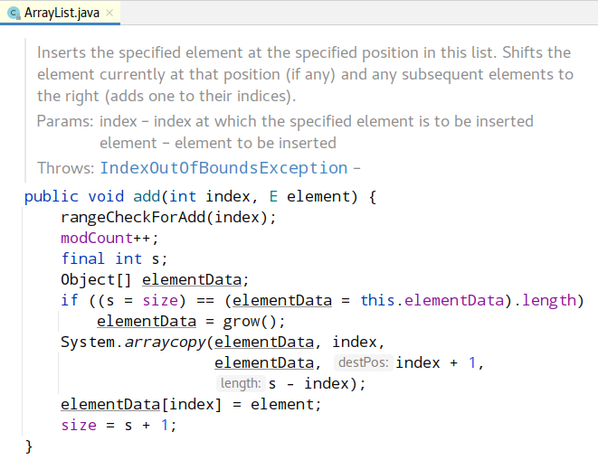
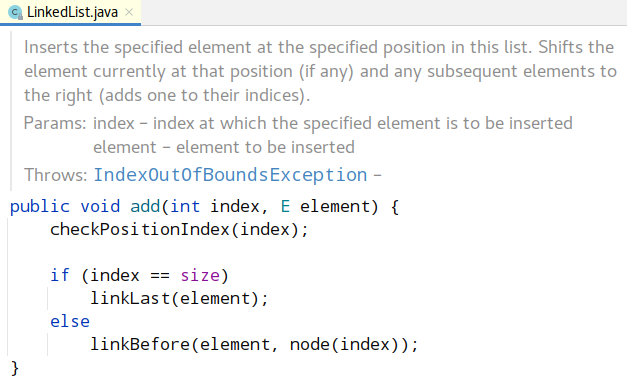

# About

Investigate insertion in the middle of `ArrayList` vs `LinkedList`.

# Results

As shown below, insertion in `ArrayList` takes much less time instead of `LinkedList`.

```text
Filling java.util.ArrayList with 1000000 elements ... done
Filling java.util.LinkedList with 1000000 elements ... done

Time elapsed for java.util.ArrayList: 3 ms
Time elapsed for java.util.LinkedList: 15 ms
```

# Why?

The source code of `java.util.ArrayList.add(int, E)` method (Java 11):



The source code of `java.util.LinkedList.add(int, E)` method (Java 11):



# Questions

Create new issue or pull request if any.
